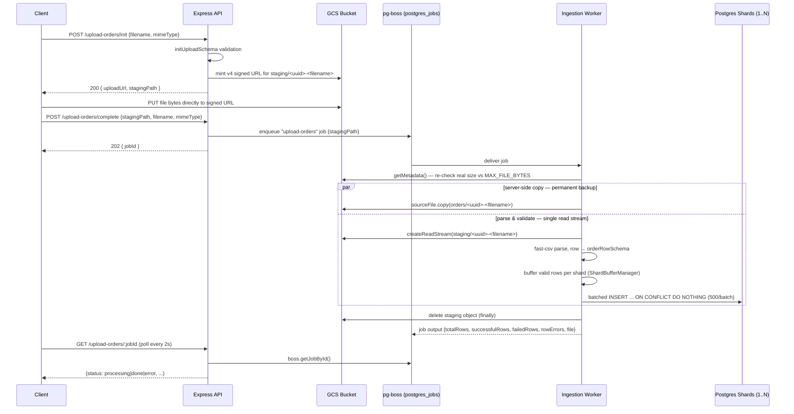
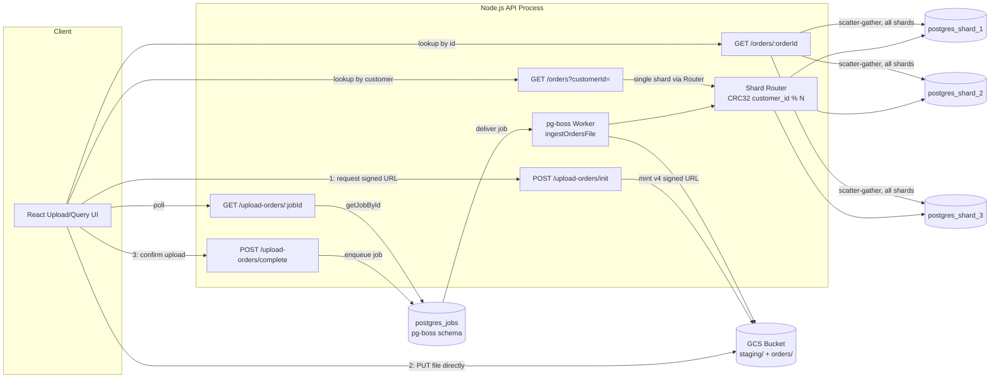

# Architecture — Sharded Order Ingestion Engine

**Author:** Backend Engineering Assessment Submission
**Scope:** `src/backend` (Node.js / Express / PostgreSQL / GCS / pg-boss)

---

## 1. Project Overview & System Purpose

This service ingests large CSV order files (10,000+ records) submitted via HTTP upload,
durably backs up the raw file to Google Cloud Storage, validates every row on the fly, and
fans valid rows out across `N` horizontally-sharded PostgreSQL instances — without ever
buffering the full file in memory and without blocking the HTTP request on the ingestion
work itself.

The design optimizes for three properties simultaneously:

| Property | Mechanism |
|---|---|
| **Constant memory footprint** | The browser uploads straight to GCS via a signed URL (no file bytes touch the API process); the worker streams the staged object through CSV parse → per-shard batch buffer, with the permanent backup done as a server-side GCS copy. No full-file buffering at any stage. |
| **Non-blocking ingestion** | `POST /upload-orders/init` + `/complete` only stage the file and enqueue a background job (pg-boss); the actual parse/validate/insert work runs asynchronously and is polled for completion. |
| **Horizontal write scaling** | Rows are routed to one of `N` independent Postgres shards by `CRC32(customer_id) % N`, so write throughput scales by adding shards, not by scaling a single instance. |

---

## 2. Architecture & Data Flow

### 2.1 End-to-end flow



### 2.2 Component diagram



---

## 3. Database Schema & Sharding Strategy

### 3.1 Schema

Identical DDL applied to every shard (`migrations/001_create_orders.sql`), tracked
per-shard in a `schema_migrations` table for idempotent re-application:

```sql
CREATE TABLE IF NOT EXISTS orders (
    order_id       VARCHAR(36) PRIMARY KEY,
    customer_id    VARCHAR(64) NOT NULL,
    order_date     TIMESTAMPTZ NOT NULL,
    order_amount   NUMERIC(12, 2) NOT NULL CHECK (order_amount >= 0),
    status         VARCHAR(32) NOT NULL DEFAULT 'PENDING',
    created_at     TIMESTAMPTZ DEFAULT CURRENT_TIMESTAMP
);

CREATE INDEX IF NOT EXISTS idx_orders_customer_date
ON orders (customer_id, order_date DESC);
```

| Column | Type | Notes |
|---|---|---|
| `order_id` | `VARCHAR(36)` | Primary key; conflict target for idempotent re-upload |
| `customer_id` | `VARCHAR(64)` | Shard key (not indexed independently — composite index below) |
| `order_date` | `TIMESTAMPTZ` | Drives the customer-scoped ordering |
| `order_amount` | `NUMERIC(12,2)` | `CHECK (>= 0)` at the DB layer |
| `status` | `VARCHAR(32)` | Defaults to `PENDING` |
| `created_at` | `TIMESTAMPTZ` | Row insertion time |

> **Note:** row-level validation (`orderRowSchema`, zod) requires `order_amount` to be
> strictly `positive()`, while the DB constraint only enforces `>= 0`. The stricter
> application-layer check is what actually gates zero-amount rows — the DB constraint is a
> defense-in-depth backstop, not the primary guard.

### 3.2 Sharding mechanism

Sharding is **application-level**, computed in Node before every write or customer-scoped
read — no Postgres-native partitioning or extension is used.

```ts
// src/db/shardRouter.ts
import { crc32 } from "zlib";

export function getShardIndexForCustomer(customerId: string): number {
  const checksum = crc32(Buffer.from(customerId));
  return checksum % shardPools.length;
}
```

Shard pools are discovered, not hardcoded:

```ts
// src/db/pool.ts
const shardUrls = Object.entries(process.env)
  .filter(([key]) => /^SHARD_\d+_URL$/.test(key))
  .sort(([a], [b]) => a.localeCompare(b, undefined, { numeric: true }))
  .map(([, url]) => url as string);

export const shardPools: Pool[] = shardUrls.map(
  (connectionString) => new Pool({ connectionString }),
);
```

`N` is simply however many `SHARD_<n>_URL` environment variables are set at boot — adding
a shard is a config change plus a migration run, not a code change.

**Why hash-mod-N on `customer_id`:**

- `CRC32` is fast, built into Node (`zlib`), and distributes non-uniform key spaces (e.g.
  customer IDs with shared prefixes) close to evenly across shards — avoiding hotspots
  that a naive range/prefix partition would create.
- Keying on `customer_id` rather than `order_id` keeps every order for a given customer on
  a single shard, which is the access pattern the primary query
  (`GET /orders?customerId=`) needs — it becomes a single-shard indexed lookup instead of
  a scatter-gather.
- **Trade-off, stated plainly:** hash-mod-N is not consistent hashing. Changing shard
  count requires a full re-shard/backfill of existing data (every customer's target shard
  changes), not just filling the new shard. At the target scale (10k–100k rows, `N` fixed
  at deploy time) this is an acceptable and simpler trade against the operational
  complexity of a hash ring.

### 3.3 Query routing

| Endpoint | Shard key known? | Routing | Query shape |
|---|---|---|---|
| `GET /orders?customerId=` | Yes (`customer_id`) | Single shard via `getShardPoolForCustomer` | `SELECT * FROM orders WHERE customer_id = $1 ORDER BY order_date DESC` — uses `idx_orders_customer_date` |
| `GET /orders/:orderId` | No — `order_id` alone doesn't reveal its shard | Scatter-gather: `Promise.all` over every shard pool, first match returned | `SELECT * FROM orders WHERE order_id = $1` fired in parallel against all `N` shards |

Scatter-gather at `N=3` is cheap (three parallel indexed point-lookups). At a much larger
`N` this endpoint would need a secondary shard-lookup index (e.g. a small
`order_id → shard_index` mapping table or cache) to avoid fanning out to every shard on
every ID lookup.

---

## 4. Ingestion Pipeline Detail

### 4.1 Stage 1 — staging (`POST /upload-orders/init` + client PUT + `POST /upload-orders/complete`)

Cloud Run hard-caps request bodies at 32MiB, so the file is never streamed through the API
process — the old Busboy/temp-file design (still described by some in-repo history) was
replaced with a direct-to-GCS, three-step flow:

1. **`POST /upload-orders/init`** — validates `{ filename, mimeType }` against
   `initUploadSchema` (`400` on mismatch), then mints a v4 signed GCS URL (15 min TTL) for
   `staging/<uuid>-<filename>` and returns `200 { uploadUrl, stagingPath }`. No file bytes
   are involved yet.
2. **Client `PUT`s the file directly to `storage.googleapis.com`** using `uploadUrl` — this
   traffic never touches the Express process.
3. **`POST /upload-orders/complete`** — validates `{ stagingPath, filename, mimeType }`
   against `completeUploadSchema`, enqueues a pg-boss job on the `upload-orders` queue with
   `{ stagingPath, filename, mimeType }` (a GCS pointer, not file data), and returns
   immediately: **`202 { jobId }`**.

### 4.2 Stage 2 — background ingestion (`ingestOrdersFile`, async worker)

Runs in-process via a pg-boss worker (`registerUploadOrdersWorker()`, started alongside
`app.listen`). Before touching the file, it re-checks the staged object's **real** size via
`stagingFile.getMetadata()` against `MAX_FILE_BYTES` (500MB) — the size the client declared
at `init` time is untrusted, since the client controls what it PUTs.

The staged file already lives durably in GCS (the client put it there), so there's no need
to tee a single read stream the way a synchronous-upload design would: the permanent backup
is a **server-side GCS copy** (`sourceFile.copy(destFile)` to `orders/<uuid>-<filename>`) —
no bytes round-trip through the worker process — run via `Promise.all` alongside a single
read stream dedicated to parsing:

- **Server-side copy — permanent backup.** `sourceFile.copy(destFile)`. Google Cloud
  Storage performs this entirely on its own infrastructure; the worker just waits on the
  promise.
- **Parse & validate — single read stream.** `sourceFile.createReadStream()` piped through
  `fast-csv`'s parser (`{ headers: true }`). The first data chunk is sniffed for a null byte
  in its first 512 bytes; if found, the parse stream is destroyed and the job fails with
  `400 "File does not appear to be a valid CSV"` — a cheap guard against binary files
  masquerading as `.csv`. Each row is validated against `orderRowSchema` (zod: trimmed
  non-empty `order_id`/`customer_id`, coerced positive `order_amount`, coerced
  `order_date`, `status` defaulting to `PENDING`). Invalid rows are **skipped, not
  thrown** — recorded as `{ row, reason }` in `rowErrors`. The failed-row list *is* the
  dead-letter record; there's no separate DLQ store.

If either side fails, the (possibly partial) permanent backup object is deleted best-effort
so a failed job doesn't leave an orphaned `orders/` object behind.

Valid rows are handed to `ShardBufferManager`:

- Routed via `getShardIndexForCustomer(customer_id)`, buffered per-shard.
- A shard's buffer flushes once it reaches `BATCH_SIZE = 500`, via a single parameterized
  multi-row insert:

  ```sql
  INSERT INTO orders (order_id, customer_id, order_date, order_amount, status)
  VALUES ($1,$2,$3,$4,$5), ($6,$7,$8,$9,$10), ...
  ON CONFLICT (order_id) DO NOTHING
  ```

  `ON CONFLICT DO NOTHING` makes re-ingesting the same file idempotent — duplicate
  `order_id`s are silently skipped rather than erroring the batch.
- Each shard tracks **at most one in-flight flush**. If a second batch fills up while a
  flush is still in progress for that shard (buffer reaches `BATCH_SIZE * 2 = 1000`), the
  CSV read stream is `pause()`d — real backpressure — and only `resume()`d once that
  shard's in-flight flush settles. This bounds per-shard memory even when one shard is
  slower than the others (e.g. contention, network latency) without stalling the other
  shards' flushes.
- On stream end, `flushAll()` awaits any in-flight flush per shard, then flushes whatever
  remains buffered.

The job resolves once **both** the copy and `flushAll()` (after CSV `end`) settle, producing:

```ts
type UploadResult = {
  file: string;            // GCS public URL of the backed-up raw file
  totalRows: number;
  successfulRows: number;
  failedRows: number;
  rowErrors: { row: number; reason: string }[];
};
```

The `staging/` object is deleted in a `finally` block once the job settles either way.

### 4.3 Why `retryLimit: 0`

The `upload-orders` pg-boss queue is created (and re-asserted via `updateQueue`, since
`createQueue` options only apply the first time a queue is created) with `retryLimit: 0`.
Ingestion failures are deterministic given the same staged file, so a retry would just fail
the same way again. This also means a worker crash mid-job (as opposed to a thrown error)
isn't retried either — there's no visible pg-boss job-expiry config here that would notice
the worker died and requeue the job, so a crash mid-processing can leave a job stuck
`active` and its staging object un-deleted until it's manually cleaned up.

### 4.4 Job polling contract

`GET /upload-orders/:jobId` reads job state via `boss.getJobById()`:

| pg-boss state | Response |
|---|---|
| queued / active | `200 { jobId, status: "processing" }` |
| completed | `200 { jobId, status: "done", ...UploadResult }` |
| failed / cancelled | `200 { jobId, status: "error", error: string }` |
| not found | `404 "Upload job not found"` |

---

## 5. Performance & Scalability Optimizations

| Concern | Approach |
|---|---|
| **Memory** | File bytes never enter the API process — the browser PUTs straight to GCS. The worker streams the staged object through CSV parse → bounded per-shard row buffers (≤1000 rows/shard at any instant), while the permanent backup is a server-side GCS copy. No full-file or full-result-set buffering. |
| **Write throughput** | Multi-row parameterized `INSERT ... ON CONFLICT DO NOTHING`, batched at 500 rows, one round-trip per batch per shard instead of per-row inserts. |
| **Backpressure** | Per-shard in-flight flush tracking pauses the source stream only when a shard actually falls behind, rather than throttling globally. |
| **Idempotency** | `ON CONFLICT (order_id) DO NOTHING` — safe to re-run the same upload. |
| **Read scaling** | Customer-scoped reads hit one shard using a covering composite index; only the shard-unaware order-ID lookup pays the scatter-gather cost. |
| **Non-blocking API** | Upload request latency is decoupled from ingestion latency — the client gets a `jobId` in milliseconds regardless of file size, and polls for completion. |
| **Structured errors** | Row-level failures don't abort the batch; the client gets a per-row error list alongside successful-row counts in one response. |

---

## 6. Resilience & Error Handling

- **`AppError`** (`src/errors/AppError.ts`) — typed HTTP errors carrying a `statusCode`
  and `isOperational = true`.
- **`errorHandler`** middleware — operational `AppError`s surface their message and status
  code; anything else returns a generic `500 "Something went wrong"`. Stack traces are
  only included in non-production responses. No-ops if headers are already sent.
- **`asyncHandler`** wraps every async route so a rejected promise reaches the central
  error handler instead of hanging the request.
- **Row-level resilience** — a malformed row is recorded and skipped, not fatal to the
  batch; a malformed file (binary/non-CSV) fails the whole job fast via the null-byte
  sniff on the first chunk.
- **Graceful shutdown** (`shutdown.ts`) — on `SIGTERM`/`SIGINT`/`uncaughtException`/
  `unhandledRejection`: stop accepting HTTP connections → `boss.stop({ graceful: true })`
  → close every shard pool → exit (0 for signals, 1 for uncaught errors).
- **Logging** — structured logging via `pino` (`pino-pretty` in dev).
- **Startup guard** — shard connectivity (`SELECT 1` against every shard) is verified once
  at boot; the process exits if any shard is unreachable rather than starting in a broken
  state.

**Known gap:** `GET /health` is liveness-only (`{ status: "ok" }`) — it does not probe
shard, pg-boss, or GCS connectivity at request time. Shard connectivity is only confirmed
once, at process boot. A production deployment would want `/health` to re-check
downstream dependencies (or a separate `/ready` probe) rather than relying solely on the
boot-time check.

---

## 7. Google Cloud Platform & Security Setup

### 7.1 Authentication — zero-secret via ADC

```ts
// src/gcloud/bucket.ts
const { GCP_PROJECT_ID, GCS_BUCKET_NAME } = process.env;
if (!GCS_BUCKET_NAME) throw new Error("GCS_BUCKET_NAME environment variable is required");
const storage = new Storage(GCP_PROJECT_ID ? { projectId: GCP_PROJECT_ID } : {});
export const bucket = storage.bucket(GCS_BUCKET_NAME);
```

No service-account key file is checked in or mounted as a secret. Locally:

```bash
gcloud auth application-default login
```

In Docker, the host's `~/.config/gcloud` (ADC cache) is mounted **read-only** into the
container, so the containerized app authenticates with the same credentials as the host
— no key material baked into the image. `GCS_BUCKET_NAME` is required at startup (throws
immediately if unset); `GCP_PROJECT_ID` is optional, used only when ADC can't infer the
project.

### 7.2 Upload pipeline security

- 500MB cap on upload size — re-checked server-side against the staged object's actual GCS
  metadata (`getMetadata()`) at worker time, since the size declared by the client at `init`
  is untrusted.
- MIME type + filename extension checked (`initUploadSchema`/`completeUploadSchema`) before
  a signed URL is minted and before the job is enqueued.
- Signed upload URLs are short-lived (15 min) and scoped to a single `staging/<uuid>-...`
  object — not a general-purpose bucket-write credential.
- Magic-byte (null-byte) sniff rejects binary payloads disguised as `.csv` before they're
  fully parsed.
- All row data reaches the database only through parameterized queries — no
  string-interpolated SQL in the ingestion or query paths (the one exception is the
  operator-only `queryShards.ts` CLI script, discussed below, which is not exposed via
  HTTP).

---

## 8. API Reference

### `POST /upload-orders/init`

Mints a short-lived signed GCS URL for the client to upload directly to.

- **Request:** `{ "filename": string, "mimeType": string }` — `.csv` filename + CSV-compatible MIME type.
- **Response `200`:**
  ```json
  { "uploadUrl": "https://storage.googleapis.com/...", "stagingPath": "staging/9f2c1e0a-orders.csv" }
  ```
- **Errors:** `400` (invalid filename/MIME type).

### `POST /upload-orders/complete`

Confirms the client's direct-to-GCS upload finished and enqueues ingestion; does not wait for it.

- **Request:** `{ "stagingPath": string, "filename": string, "mimeType": string }` — `stagingPath` as returned by `init`.
- **Response `202`:**
  ```json
  { "jobId": "9f2c1e0a-..." }
  ```
- **Errors:** `400` (invalid request body), `500` (enqueue failure). Actual file-size enforcement (`413`, >500MB) happens server-side in the worker against the real GCS object size, not at this endpoint.

### `GET /upload-orders/:jobId`

Poll ingestion status.

- **Response `200` (processing):**
  ```json
  { "jobId": "9f2c1e0a-...", "status": "processing" }
  ```
- **Response `200` (done):**
  ```json
  {
    "jobId": "9f2c1e0a-...",
    "status": "done",
    "file": "https://storage.googleapis.com/<bucket>/orders/<uuid>-orders.csv",
    "totalRows": 10000,
    "successfulRows": 9973,
    "failedRows": 27,
    "rowErrors": [{ "row": 42, "reason": "Invalid order_amount" }]
  }
  ```
- **Response `200` (error):**
  ```json
  { "jobId": "9f2c1e0a-...", "status": "error", "error": "File does not appear to be a valid CSV" }
  ```
- **Errors:** `404` if `jobId` unknown.

### `GET /orders/:orderId`

Scatter-gather lookup across all shards.

- **Response `200`:** single order row `{ order_id, customer_id, order_date, order_amount, status, created_at }`
- **Errors:** `404 { "error": "Order not found" }`

### `GET /orders?customerId=`

Single-shard lookup, newest first.

- **Response `200`:** array of order rows.
- **Errors:** `400` if `customerId` missing/empty.

### `GET /health`

- **Response `200`:** `{ "status": "ok" }` — liveness only (see §6 gap note).

### `GET /metrics`

- **Response `200`:**
  ```json
  {
    "uploadsStarted": 5,
    "uploadsSucceeded": 4,
    "uploadsFailed": 1,
    "rowsIngested": 39872,
    "rowsFailed": 128,
    "uptimeSeconds": 3021
  }
  ```
  Plain JSON counters (not Prometheus exposition format).

---

## 9. Setup, Deployment & Local Testing

### 9.1 Bring up shards + job queue

```bash
cd src/backend
docker compose up -d postgres_shard_1 postgres_shard_2 postgres_shard_3 postgres_jobs
```

Four independent Postgres 15 containers: three order shards (`shard_1`/`shard_2`/`shard_3`,
host ports `5432`/`5433`/`5434`) and one pg-boss job-queue database (`jobs`, host port
`5435`) — kept structurally and physically separate from the shards, since pg-boss
self-manages its own schema there.

### 9.2 Configure environment

```bash
gcloud auth application-default login   # ADC for GCS
cp .env.example .env                    # SHARD_1_URL..SHARD_3_URL, PGBOSS_URL, GCS_BUCKET_NAME
```

`GCS_BUCKET_NAME` and `PGBOSS_URL` are required — both throw at process startup if unset.

### 9.3 Run migrations

```bash
npm run migrate
```

Applies every file in `migrations/*.sql` to **every shard in parallel**, tracked
per-shard in a `schema_migrations` table so re-running is idempotent (does not touch the
pg-boss database).

### 9.4 Run the app

```bash
npm run dev     # tsx watch, local iteration
# or
npm run build && npm start
```

### 9.5 Full Docker Compose (app + all DBs)

```bash
docker compose up -d
```

> **Gotcha:** the `app` service loads `.env` **and** `.env.docker` via `env_file:`, with
> `.env.docker` values winning for shared keys. `.env` points shard URLs at
> `localhost:5432/5433/5434` for host-side tooling (e.g. `npm run migrate` outside
> Docker); `.env.docker` repoints them at the compose service names
> (`postgres_shard_1:5432`, etc.), since containers can't reach each other via
> `localhost`. Forgetting to create `.env.docker` from `.env.docker.example` means the
> containerized app tries to dial shards on its own loopback and fails to connect.

### 9.6 Ad hoc shard inspection

```bash
npm run query -- "SELECT COUNT(*) FROM orders;"
```

Runs a raw SQL string against every shard in sequence and prints one table per shard.
Operator tool only — not parameterized, not exposed over HTTP.

---

## 10. Design Decisions — Summary

| Decision | Alternative considered | Why this was chosen |
|---|---|---|
| Application-level `CRC32(customer_id) % N` sharding | Postgres declarative partitioning / consistent hashing ring | Simple, dependency-free (Node stdlib `zlib`), keeps a customer's orders co-located on one shard for the primary read path; re-sharding cost accepted as reasonable at fixed, assessment-scale `N` |
| Direct-to-GCS signed-URL upload (`init`/`complete`) | Stream the file through the API (old Busboy/temp-file design) | Cloud Run hard-caps request bodies at 32MiB — files couldn't be streamed through the API process at all; the client PUTs straight to GCS instead |
| Server-side GCS copy for the permanent backup, in parallel with a single parse stream | Tee one read stream into a GCS write + CSV parse (viable when the API read the bytes off the wire itself) | The file already lives durably in GCS once staged — re-streaming it through the worker just to write it back would be a redundant download+upload round trip; `File.copy()` runs entirely on GCS's side |
| Background job via pg-boss, not synchronous ingestion | Ingest inline within the HTTP request | 10k+ row files would otherwise hold the request open for the full parse/validate/insert duration; decoupling keeps the upload endpoint fast and poll-based status is simpler than long-lived connections/websockets |
| Per-shard bounded buffer + real backpressure | Unbounded per-shard queue | Prevents one slow shard from causing unbounded memory growth while letting fast shards keep flushing independently |
| `retryLimit: 0` on the ingestion queue | Default pg-boss retries | Ingestion failures are deterministic given the same staged file; retrying just reproduces the same error |
| `ON CONFLICT (order_id) DO NOTHING` | Fail the batch on duplicate key | Makes re-uploading the same file a safe, idempotent no-op for already-ingested rows |
| Scatter-gather for `GET /orders/:orderId` | A dedicated shard-lookup index/table | `order_id` carries no shard information and a lookup table adds write-path complexity not justified at `N=3`; acceptable fan-out cost at this scale |
